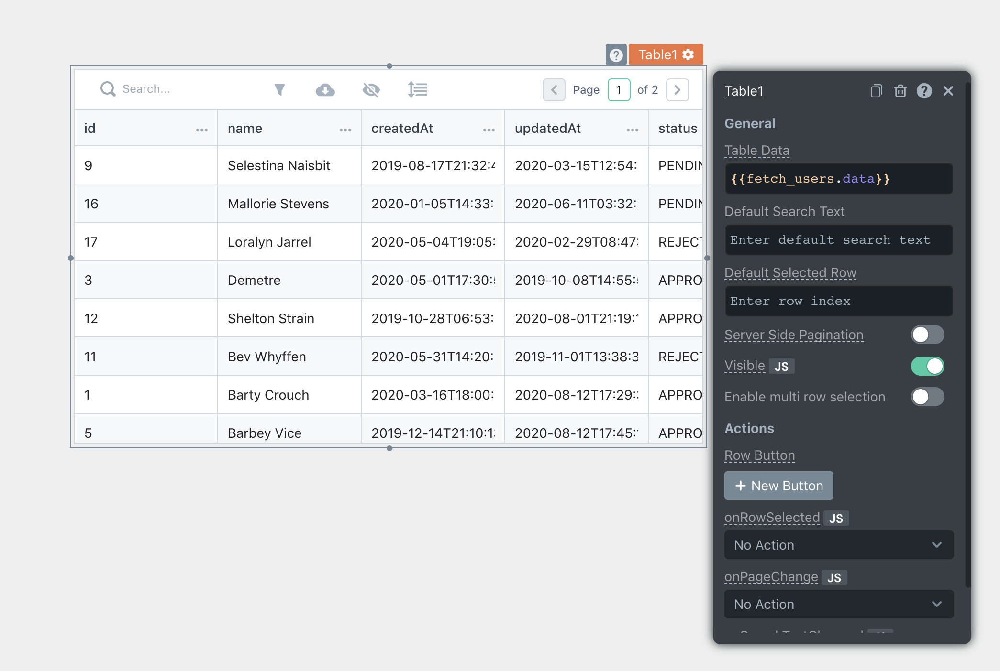

# Querying a Database

You can write queries to fetch and update data from a database using the query editor interface provided by Appsmith for each database type. This article assumes you have already [connected to your database](./).

## **Setting up a Query**

Go to the page that needs to run this query.

1. Go to DB **Queries → +**.
2. Choose the connected database and click +New Query
3. You will be taken to the query editor to write the query.
4. Note that the query is created with a default name. It’s recommended that you rename it for readability and access.
5. Write your query in the syntax that is valid for your [database type](./#supported-databases).


Queries are auto-saved to you never lose your work. These changes will be reflected in your published application only after you deploy.



A query and its results can be accessed from only the page that it is part of. To use a query on another page, click the context menu next to the query name and clone it.


### **Naming a Query**

A query must have a unique name that acts as an identifier. It is used to access the query results. In that sense, a name is like a variable in a programming language. You can access the various properties of the query results object using the query’s name.

```text
{{ query1.data }}
```

Since the scope of a query is its parent page, all queries within a page must have unique names.

### **Running a query**

Click on the Run button to execute a query. If the query execution succeeds, a success message will pop up on the screen in the top right corner along with the results below the query.

## **Using JavaScript inside a query**

In addition to allowing you to query your database, Appsmith allows you to write JavaScript inside your query. This comes in handy when you want to take input\(s\) from a widget or other entities inside your application. The below example illustrates writing a query that filters results based on the selected option of a dropdown.

```text
select * from users where gender = '{{genderDropdown.selectedOptionValue}}'
```

## **Triggering a query from the UI**

When you build an application, you’ll need the app to trigger the query to run when the user performs an action. Appsmith allows you to trigger this on a widget’s events. Read more about [triggering a query from the UI](../building-the-ui/calling-apis-from-widgets.md)

## **Accessing query results**

A query’s results are stored in an object that is identified by the query’s name. You can access the query’s results in the data property of the object. For example, if the query’s name is`fetchUsers`, to access its results you’ll write `{{ fetchUsers.data }}`. This can be used in a table to display the results of the query



#### Query results object

All queries return an array of objects where each object is a row returned by the query and each property in the object is a column. This object is immutable and cannot be changed by javascript.

