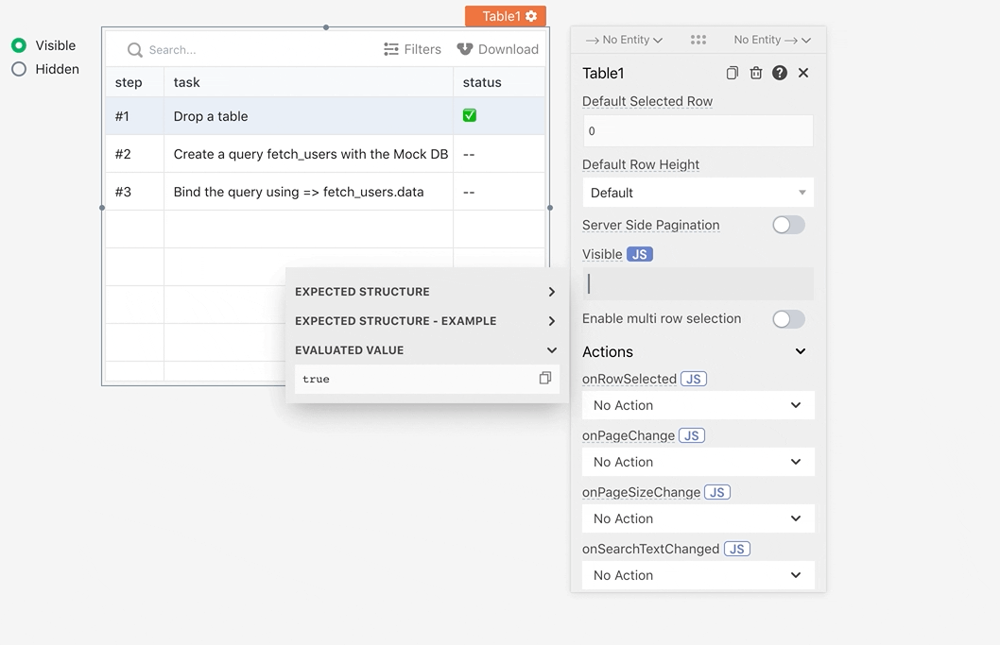

# Controlling Widget Visibility

The visibility property is usually a switch in the property pane of every widget. This property can be made dynamic by clicking the JS button next to the property which converts it to a text field. Inside the text, the value of the visibility can be conditionally set using javascript.

## Control Visibility with other widgets

In the example below the visibility of the table is a conditional value based on the selected value of the RadioGroup

```javascript
{{RadioGroup1.selectedOptionValue === "Visible"}}
```


The Visible property expects the expression to evaluate to a boolean value




## Control Visibility with Query responses

Similar to the above example, we can tie the visibility of a widget to the response of a Query.

```javascript
{{ API1.data.value === "trueValue" }}
```

## Dynamic Forms

There are some cases that require form fields to dynamically change based on the user input. This can be achieved using a Tab widget inside the form and conditionally updating the selected tab value based on the inputs of the form



Hide the tabs in the tab widget to make it look like the views are changing in place


