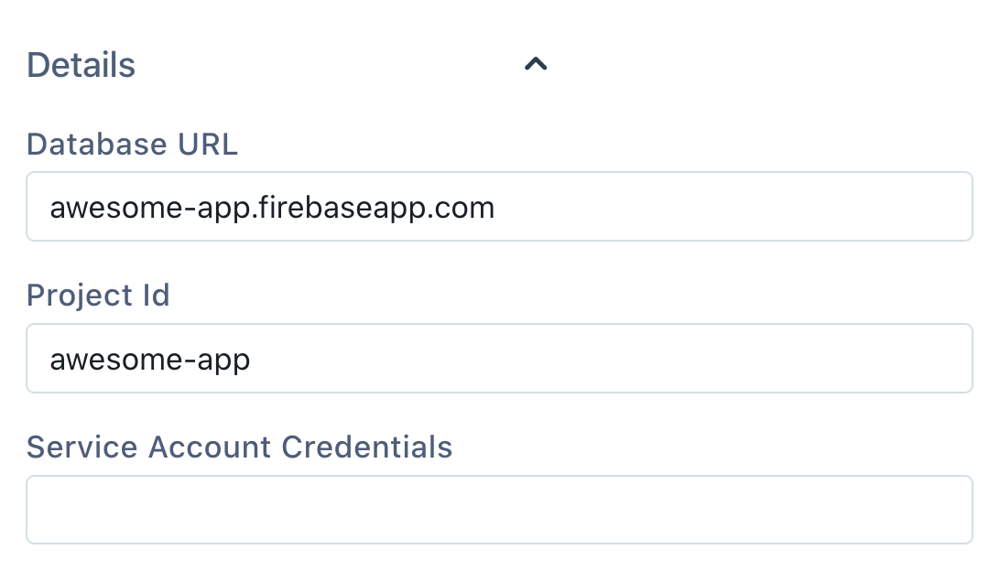
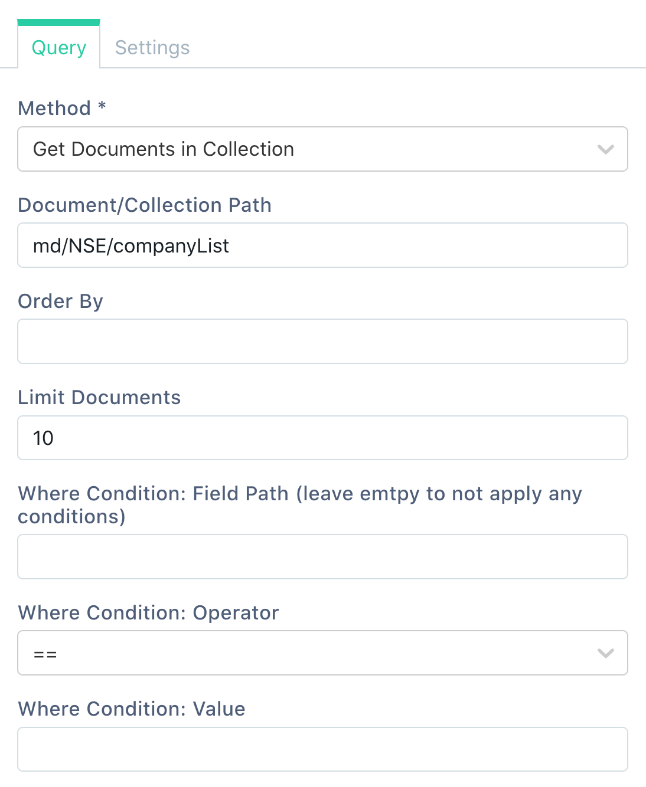

# Firestore


The following document assumes that you understand the [basics of connecting to databases on Appsmith](../core-concepts/connecting-to-data-sources/connecting-to-databases/). If not, please go over them before reading further.


## Connection Settings

The Firestore plugin requires three pieces of information to connect to Firestore.



The above details are available from the Firebase Console. Let's fetch them in turn.

#### Fetching Project ID

1. Go to "Project Settings" in your Firebase console and ensure you're in the "General" tab.
2. Here, you'll find a "Project ID" entry with a value.
3. Copy this value into the "Project ID" field in the Firestore configuration.

#### Fetching Database URL

1. Now open the "Service Accounts" tab on the same page.
2. Here you should see a NodeJS code snippet with a `databaseURL` object field.
3. Copy the URL in this value \(**without https://**\) and paste it in the "Database URL" field of the Firestore configuration.

#### Fetching Service Account Credentials

1. On the service accounts tab, below the code snippet, there is a "Generate new private key" button.
2. Clicking this button will generate a new private key with access to this Firestore instance.
3. This key will be in the form of a JSON file which will be downloaded when you click this button.
4. Copy the **contents** of this file and paste it into the "Service Account Credentials" field.

After filling up the three fields as described above, click on the "Test" button to verify the configuration and click "Save".

## Fetching Data

There are two methods for fetching data from Firestore. One for fetching a single document by a path and another for fetching multiple documents from a collection by a path.

### Fetching Single Document

Select the method "Get Single Document" in the Method dropdown and set the path to the full path of the document you want to load. The path should be provided **without** any leading or trailing `/` characters.

For example, setting the path to `users/sherlock@gmail.com` will get the document with ID `sherlock@gmail.com` inside the collection `users`.

### Fetching Multiple Documents

Select the method "Get Documents in Collection" in the Method dropdown and set the path to the collection from which we want to fetch the documents. The path should be provided **without** any leading or trailing `/` characters.



**Order By**: Set this to a field name by which the documents should be sorted. For example, if in the given collection, you have a collection as `{"name": "Sherlock", "role": "Detective"}` and `{"name": "Watson", "role": "Doctor"}`, then specifying `name` in the Order By input will return the documents ordered by the name field in each document.

**Limit Documents**: This field is a number that specifies the maximum number of documents fetched by the query. Setting this to a _very_ high number may impact the performance of your application, but the impact and how high will depend on the size of the documents being fetched.

**Where Condition**: This is a set of three fields that allow you to apply a filter on the documents being fetched. The first field **Field Path** is the path of a nested field on which to apply the filter. Example values are `name` or `name.first` if the documents look like `{"name": {"first": "Sherlock", "last": "Holmes"}}`. 

The second field is the operator and the third is the value to apply the filter with. For array operators like in, the value can be set to a valid JSON-serialized array. For example, the field path can be `name`, the operator can be `in` and the value can be `["Sherlock", "Mycroft"]`. This will filter all documents with a `name` field set to either `"Sherlock"` or `"Mycroft"`.

## Adding New Document\(s\)

There are three methods that can be used to add documents to a collection, depending on the behavior needed.

1. "**Set Document**" method: This method will _set_ the given document at the given _document path_. If a document already exists at the given path, it will be **overridden**. If a document doesn't already exist at this path, the path will be created and this document will be set.
2. "**Create Document**" method: This method will _set_ the given document at the given _document path_. If a document already exists at the given path, this method will **fail** and the given document is **not saved**. If a document doesn't already exist at this path, the path will be created and this document will be set.
3. "**Add Document to Collection**" method: This method will _add_ the given document with an auto-generated document-id, into the given _collection path_. Note that in this method, the given path must point to a collection. If the collection doesn't exist at the given path, it will be created.

All three methods above take a path and a body as inputs. The path is interpreted as described above and the body is expected to contain a valid JSON-serialized object which will make up the document to be used in the operation \(as described above\).

## Updating a Document

The "Update Document" method can be used to surgically update only certain fields in a document while leaving the rest of the document as is. It takes the document path pointing to the document that should be updated and a body of changes. For example, if the body is set to the following:

```javascript
{
    "name": "Eve"
}
```

Then the value of the `name` field in the document pointed by path will be changed to `"Eve"`, but no other fields in the document will be changed.

Values of nested fields should be set in the form of field paths. For example, consider the following document that's already saved in our Firestore:

```javascript
{
    "name": {
        "first": "Sherlock",
        "last": "Holmes"
    },
    "role": "Detective"
}
```

Say we want to update the first name to `"Mycroft"`, but leave the rest of the document \(including the last name\) intact. Then the body in the update method should be:

```javascript
{
    "name.first": "Mycroft"
}
```

Note that this method can only update a single document at once. Firestore doesn't provide a way to bulk-update multiple documents at once.

## Deleting Document

The "**Delete Document**" method deletes the document at the given path. 


Deleting a document by giving a non-existing path is **NOT** treated as an error.


## Taking Inputs from Widgets

Queries can take inputs from widgets using javascript inside the query and referencing the widget property. Open `{{ }}` inside the query to write javascript and access other entities on the page using their names.


You need to wrap your mustache bindings in double quotes to ensure it is valid JSON


```javascript
{
    "name": "{{ nameInput.text }}"
}
```



