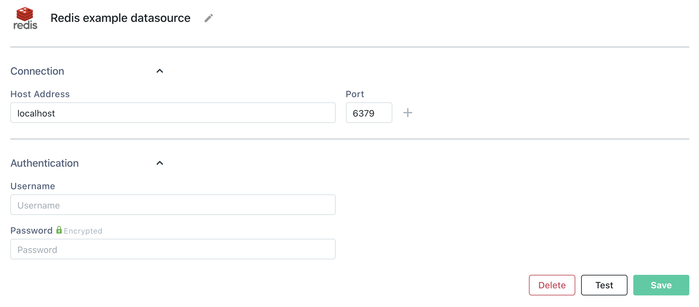

# Redis


The following document assumes that you understand the [basics of connecting to databases on Appsmith](../core-concepts/connecting-to-data-sources/connecting-to-databases.md). If not, please go over them before reading further.


## Connection Settings

Appsmith needs the following information to connect to a Redis instance.



After filling up the three fields as described above, click on the "Test" button to verify the configuration and click "Save".

## Querying Redis

The Redis query pane can be used to run any of the commands supported by Redis. The response from this command is displayed in the result window. Please refer to the official [documentation](https://redis.io/commands) for the list of commands that are supported. A few examples are listed below.

### Checking connection

The connection to a Redis instance can be verified using a simple `PING` command.

```text
PING
```

### Inserting a key

A new key value pair can be inserted into the cache using the `SET` command as follows.

```text
SET key_name new_value
```

### Retrieving a key

Stored key value pairs can be retrieved using the `GET` command.

```text
GET key_name
```

## Using Queries in applications

Once you have successfully run a Query, you can use it in your application to

* [Display Data](../core-concepts/displaying-data-read/)
* [Capture Data](../core-concepts/capturing-data-write/)

