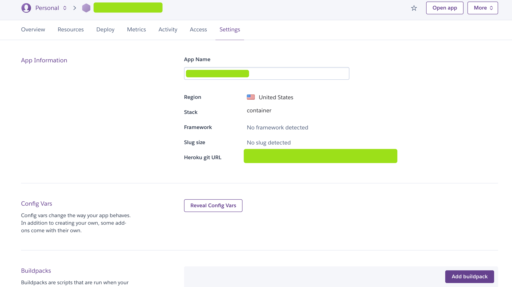
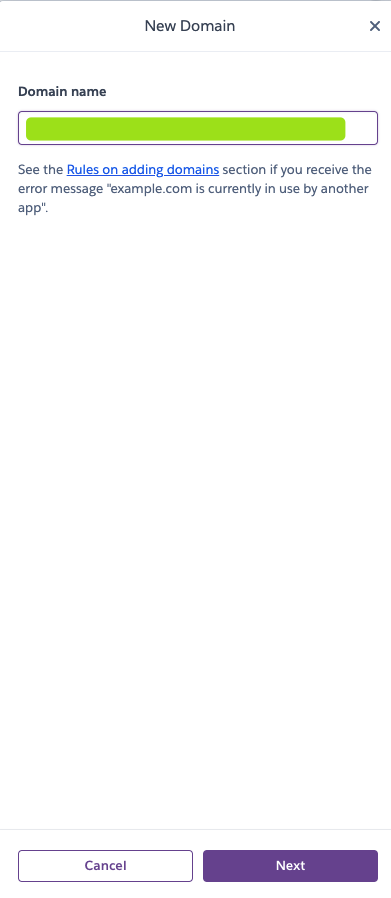
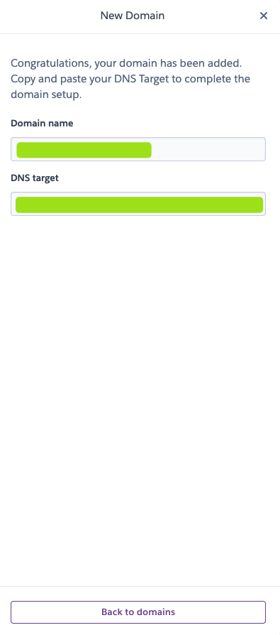

# Getting started

You can begin using Appsmith via our cloud instance or by deploying Appsmith yourself

* [Using Appsmith Cloud](quick-start.md#appsmith-cloud) **\(recommended\):** Create a new application with just one click
* [Using Docker](quick-start.md#docker): Deploy anywhere using docker
* [Deploy to Heroku](quick-start.md#heroku): Deploy Appsmith on Heroku with a single click
* [Using Kubernetes](quick-start.md#kubernetes): Deploy to your Kubernetes cluster

## Appsmith Cloud

The fastest way to get started with Appsmith is using our cloud-hosted version. It's as easy as

1. [Create an Account](https://app.appsmith.com/user/signup)
2. [Start Building](core-concepts/building-the-ui/)

## Docker

Appsmith can be deployed locally or on your private instance using docker. To simplify installation, Appsmith comes with an installation script that will download all of the necessary dependencies and help you configure Appsmith.

**Supported Operating Systems**

* macOS
* Ubuntu
* OpenSuse
* Debian
* CentOS


For Mac, [Docker Desktop](https://docs.docker.com/docker-for-mac/install/) is required. For other operating systems, Docker will be installed automatically by the script.


1. Fetch the **install.sh** script on the system you want to deploy Appsmith

```bash
# Downloads install.sh
curl -O https://raw.githubusercontent.com/appsmithorg/appsmith/master/deploy/install.sh
```

2. Make the script executable

```bash
chmod +x install.sh
```

3. Run the script. **Do not run as sudo & make sure no other processes are running on ports 80 & 443**.

```bash
./install.sh
```

4. Check if all the containers are running correctly.

```bash
docker ps

#Output should look like this
CONTAINER ID        IMAGE                             COMMAND                  CREATED             STATUS              PORTS                                      NAMES
3b8f2c9638d0        appsmith/appsmith-editor          "/bin/sh -c 'while :…"   17 minutes ago      Up 17 minutes       0.0.0.0:80->80/tcp, 0.0.0.0:443->443/tcp   appsmith_nginx_1
f5a365aada1c        appsmith/appsmith-server:latest   "/bin/sh -c /entrypo…"   17 minutes ago      Up 17 minutes       0.0.0.0:8080->8080/tcp                     appsmith_appsmith-internal-server_1
84b15adf470a        mongo                             "docker-entrypoint.s…"   17 minutes ago      Up 17 minutes       0.0.0.0:27017->27017/tcp                   appsmith_mongo_1
09b42d5b0f1a        redis                             "docker-entrypoint.s…"   17 minutes ago      Up 17 minutes       0.0.0.0:6379->6379/tcp                     appsmith_redis_1
90833ba6d75a        certbot/certbot                   "/bin/sh -c 'trap ex…"   17 minutes ago      Up 17 minutes       80/tcp, 443/tcp                            appsmith_certbot_1
```


* Ensure your security groups are configured to allow traffic to ports 80 & 443 on your installation instance. 
* You can access the running application on [**http://localhost**](http://localhost) in any browser or the **public IP** of your machine.
* You may need to wait 2 - 3 minutes before accessing the application to allow nginx to start.



\(Windows & OS X\): The default Docker setup on Windows and OS X uses a VirtualBox VM to host the Docker daemon. Unfortunately, the mechanism VirtualBox uses to share folders between the host system and the Docker container is not compatible with the memory mapped files used by MongoDB. This means that it is not possible to run a MongoDB container with the data directory mapped to the host.

The fix is to keep the /data/db mounted directory out of mounted volumes \(like downloads, user etc.\) or to create a volume with docker volume create.

**Reference:** [https://iainhunter.wordpress.com/2016/01/12/avoiding-pitfalls-running-mongo-3-2-in-docker-on-osx/](https://iainhunter.wordpress.com/2016/01/12/avoiding-pitfalls-running-mongo-3-2-in-docker-on-osx/)


### Custom Domains

To host Appsmith on a custom domain, you can contact your domain registrar and update your DNS records. Most domain registrars have documentation on how you can do this yourself.

* [GoDaddy](https://in.godaddy.com/help/create-a-subdomain-4080)
* [Amazon Route 53](https://aws.amazon.com/premiumsupport/knowledge-center/create-subdomain-route-53/)
* [Digital Ocean](https://www.digitalocean.com/docs/networking/dns/how-to/add-subdomain/)
* [NameCheap](https://www.namecheap.com/support/knowledgebase/article.aspx/9776/2237/how-to-create-a-subdomain-for-my-domain)
* [Domain.com](https://www.domain.com/help/article/domain-management-how-to-update-subdomains)

## Troubleshooting

If at any time you encounter an error during the installation process, reach out to **support@appsmith.com** or join our [Discord Server](https://discord.com/invite/rBTTVJp)

If you know the error and would like to reinstall Appsmith, simply delete the installation folder and the templates folder and execute the script again

## Updating to the latest release

Appsmith Installations can be updated by running the following command in the installation directory

```text
#!/bin/sh
sudo su
docker-compose pull && docker-compose rm -fsv appsmith-internal-server nginx && docker-compose up -d
```

## Heroku 

Quickly set up Appsmith to explore product functionality using Heroku.

### Heroku Installation
- Sign up for a free account on Heroku
- Click the button [](https://heroku.com/deploy?template=https://github.com/appsmithorg/appsmith/tree/master)
- Fill in the required `Config Variables`  including:
  - `APPSMITH_ENCRYPTION_PASSWORD`: Encryption password to encrypt all credentials in the database
  - `APPSMITH_ENCRYPTION_SALT`: Encryption salt used to encrypt all credentials in the database
  - `APPSMITH_MONGODB_URI`: Your Mongo Database URI
- (Optional) Customize the default settings in Heroku
  - `App Name`: Optionally select a name for your application (this will be used in the app URL)
  - `Runtime Selection`: Select which region your app should run in (United States or Europe)
  - `Config Variables`:
    - Email Configuration:
      - `APPSMITH_MAIL_ENABLED`: Set this value to true to enable email sending (value should be `true/false` only)
      - `APPSMITH_MAIL_FROM`: Email ID using which emails will be sent from your installation
      - `APPSMITH_REPLY_TO`: Email ID to which all email replies will be sent to
      - `APPSMITH_MAIL_HOST`: The host endpoint for the SMTP server
      - `APPSMITH_MAIL_SMTP_TLS_ENABLED`: Set this value to enable TLS for your SMTP server (value should be `true/false` only)
      - `APPSMITH_MAIL_USERNAME`: SMTP username
      - `APPSMITH_MAIL_PASSWORD`: SMTP password
    - Oauth Configuration:
      - Google Oauth:
        - `APPSMITH_OAUTH2_GOOGLE_CLIENT_ID`: Client ID provided by Google for OAuth2 login
        - `APPSMITH_OAUTH2_GOOGLE_CLIENT_SECRET`: Client secret provided by Google for OAuth2 login
      - Github Oauth:
        - `APPSMITH_OAUTH2_GITHUB_CLIENT_ID`: Client ID provided by Github for OAuth2 login
        - `APPSMITH_OAUTH2_GITHUB_CLIENT_SECRET`: Client secret provided by Github for OAuth2 login
    - `APPSMITH_GOOGLE_MAPS_API_KEY`: Google Maps API key which is required if you wish to leverage Google Maps widget. Read more at: https://docs.appsmith.com/third-party-services/google-maps
    - `APPSMITH_DISABLE_TELEMETRY`: We want to be transparent and request that you share anonymous usage data with us. This data is purely statistical in nature and helps us understand your needs & provide better support to your self-hosted instance. You can read more about what information is collected in our documentation https://docs.appsmith.com/telemetry/telemetry

    After Heroku finishes setting up the app, click “View” and your Appsmith should be up and running. You will be taken to the account creation page, where you can enter credentials to create an account and get started.



- We use Heroku Redis addon for caching which required your account to have billing information, but we use the free plan of this addon so it will charge you nothing. Please make sure your account already finish providing billing information.
- You may need to wait 2 - 3 minutes before accessing the application.


### Custom domain
To create your custom domain with your app, please follow these steps below:
- Go to your app's settings tab

- Click `Add domain` button in Domains section

- Input your domain name & click `Next`. Heroku will provide you a DNS Target that you can map your domain with  
  


- Make sure that your DNS Record is update so that your custom domain will map to `DNS Target`

- Once you finish, now you can access Appsmith from your custom domain


- Once you use a custom domain, You might want to setup SSL for your dyno. Please check the official document of Heroku [how to configure SSL](https://devcenter.heroku.com/articles/ssl)
- Your dyno will need to be upgrade to at least `hobby` type to use this feature of heroku



### Re-Deploy your App using Heroku CLI
To re-deploy your app (re-build & re-run), make sure you have Docker & Heroku CLI setup locally then follow steps below:
- Pull the appsmith repository & move to `heroku` folder:
    ```
    git clone --branch master https://github.com/appsmithorg/appsmith
    cd ./appsmith/deploy/heroku
    ```
- Login to Heroku CLI
    ```
    heroku login
    ```
- Login to Container Registry
    ```
    heroku container:login
    ```
- Get your application name
    ```
    heroku apps
    ```
- Push your Docker-based app
    ```
    heroku container:push web -a <Your App Name>
    ```
- Deploy the changes
    ```
    heroku container:release web -a <Your App Name>
    ```

## Kubernetes

We provide an installation script that will help you configure Appsmith & deploy your app on a Kubernetes cluster.
### Prerequisites
* Ensure `kubectl` is installed and configured to connect to your cluster
    * Install kubeclt: [kubernetes.io/vi/docs/tasks/tools/install-kubectl/](https://kubernetes.io/vi/docs/tasks/tools/install-kubectl/)
    * Minikube: [Setup Kubectl](https://minikube.sigs.k8s.io/docs/handbook/kubectl/)
    * Google Cloud Kubernetes: [Configuring cluster access for kubectl
](https://cloud.google.com/kubernetes-engine/docs/how-to/cluster-access-for-kubectl)
    * Aws EKS: [Create a kubeconfig for Amazon EKS](https://docs.aws.amazon.com/eks/latest/userguide/create-kubeconfig.html)
    
    * Microk8s: [Working with kubectl](https://microk8s.io/docs/working-with-kubectl)
* Kubernetes NGINX Ingress Controller must be enable on your cluster by default. Please make sure that you install the right version for your cluster
    * Minikube: [Set up Ingress on Minikube with the NGINX Ingress Controller](https://kubernetes.io/docs/tasks/access-application-cluster/ingress-minikube/)
    * Google Cloud Kubernetes: [Ingress with NGINX controller on Google Kubernetes Engine](https://kubernetes.github.io/ingress-nginx/deploy/)
    * AWS EKS: [Install NGINX Controller for AWS EKS](https://kubernetes.github.io/ingress-nginx/deploy/#network-load-balancer-nlb)
    * Microk8s: [Add on: Ingress](https://microk8s.io/docs/addon-ingress)
* Script tested on Minikube with Kubernetes v1.18.0

### Deployment Steps

1. Fetch the **install.k8s.sh** script on the system you want to deploy appsmith

```bash
# Downloads install.sh
curl -O https://raw.githubusercontent.com/appsmithorg/appsmith/master/deploy/k8s/install.k8s.sh
```

2. Make the script executable

```bash
chmod +x install.k8s.sh
```

3. Run the script.

```bash
./install.k8s.sh
```

4. Check if all the pods are running correctly.

```bash
kubectl get pods

#Output should look like this
NAME                                        READY   STATUS      RESTARTS    AGE
appsmith-editor-cbf5956c4-2zxlz             1/1     Running     0           4m26s
appsmith-internal-server-d5d555dbc-qddmb.   1/1     Running     2           4m22s
imago-1602817200-g28b2                      1/1     Running     0           4m39s
mongo-statefulset-0                         1/1     Running     0           4m13s
redis-statefulset-0                         1/1     Running     0           4m00s
```

5. Custom Appsmith's Configuration
  * After you successfully run the script, all the configuration files have been downloaded and & stored into `<Installation Path>`
  * If you want to update your app settings (ex: database host). Go to the `<Installation Path>/config-template`, update the corresponding value in the configmap file, then restart the pods.
  * Below steps will help you update database hostname of your application:
    * Open file `appsmith-configmap.yaml` in `<Installation Path>/config-template` folder
    * Update the value of variable `APPSMITH_MONGODB_URI` to your database host name
    * Run commands:
```
kubectl apply -f appsmith-configmap.yaml
kubectl scale deployment appsmith-internal-server --replicas=0
kubectl scale deployment appsmith-internal-server --replicas=1
```


* You can access the running application on the **Ingress Endpoint** if you not chose to provide custom domain for your application .
```
kubectl get ingress
NAME               CLASS    HOSTS   ADDRESS          PORTS   AGE
appsmith-ingress   <none>   *       XXX.XXX.XX.XXX   80      2m
```
* You may need to wait 2-3 minutes before accessing the application to allow application start (depends on your cluster).


### Custom Domains

To host Appsmith on a custom domain, you can contact your domain registrar and update your DNS records. Most domain registrars have documentation on how you can do this yourself.

* [GoDaddy](https://in.godaddy.com/help/create-a-subdomain-4080)
* [Amazon Route 53](https://aws.amazon.com/premiumsupport/knowledge-center/create-subdomain-route-53/)
* [Digital Ocean](https://www.digitalocean.com/docs/networking/dns/how-to/add-subdomain/)
* [NameCheap](https://www.namecheap.com/support/knowledgebase/article.aspx/9776/2237/how-to-create-a-subdomain-for-my-domain)
* [Domain.com](https://www.domain.com/help/article/domain-management-how-to-update-subdomains)


* During the setup of Ingress Controller on your cloud. You will need to map your custom domain with the External IP of the controller before running the installation script
* Below is an example how to achieve the External IP of NGINX Ingress Controller
```
➜ kubectl get svc -n ingress-nginx
NAME                                 TYPE           CLUSTER-IP    EXTERNAL-IP    PORT(S)                      AGE
ingress-nginx-controller             LoadBalancer   XX.XXX.X.XX   XX.XX.XX.XXX   80:XXXXX/TCP,443:XXXXX/TCP   17h
ingress-nginx-controller-admission   ClusterIP      XX.XXX.X.XX   <none>         443/TCP                      17h
```


## Troubleshooting

If at any time you encounter an error while installation Appsmith on any platform, reach out to **support@appsmith.com** or join our [Discord Server](https://discord.com/invite/rBTTVJp)

If you know the error and would like to reinstall Appsmith, simply delete the installation folder and the templates folder and execute the script again

