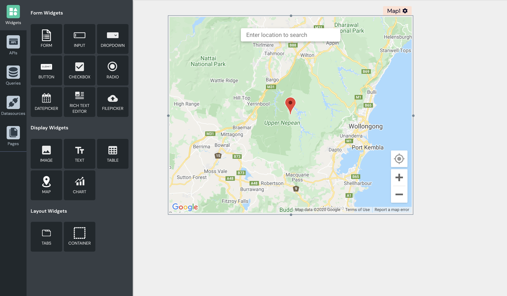
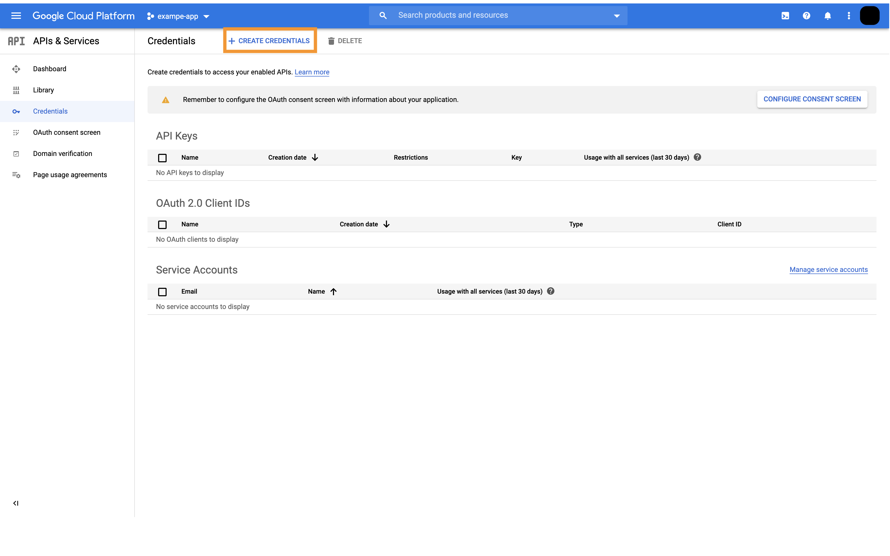
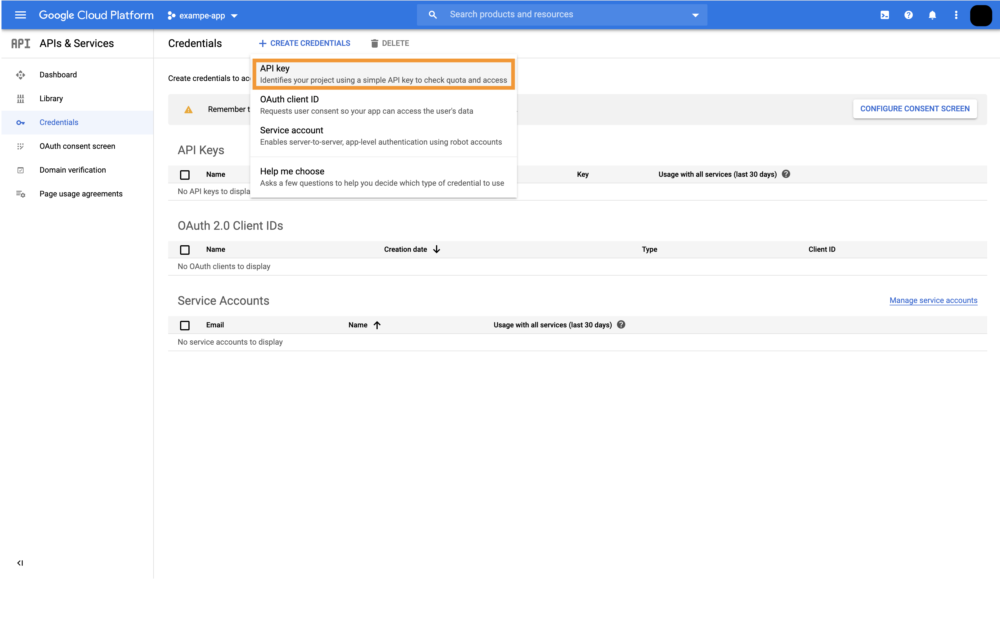

# Google Maps



To enable the maps widget, login to your [google cloud console](https://console.cloud.google.com/)

**1. Navigate to the** [**credentials section**](https://console.cloud.google.com/apis/credentials) **under APIs & Services**



**2. Create a new API Key Credential**



**3. Restrict the API Key**


**4. Enable the following APIs**

* Maps Embed API
* Maps JavaScript API
* Places API
* Geolocation API


**5. Update the docker.env file in your appsmith deployment folder**

```text
# ******** Google Maps ***********
APPSMITH_GOOGLE_MAPS_API_KEY=YOUR_API_KEY
# ********************************
```

**5. Restart docker & nginx**

```text
sudo docker-compose rm -fsv appsmith-internal-server nginx && sudo docker-compose up -d 
```

The maps widget should now be enabled on your installation. Read more about [Obtaining a google API key](https://developers.google.com/maps/documentation/javascript/get-api-key)

