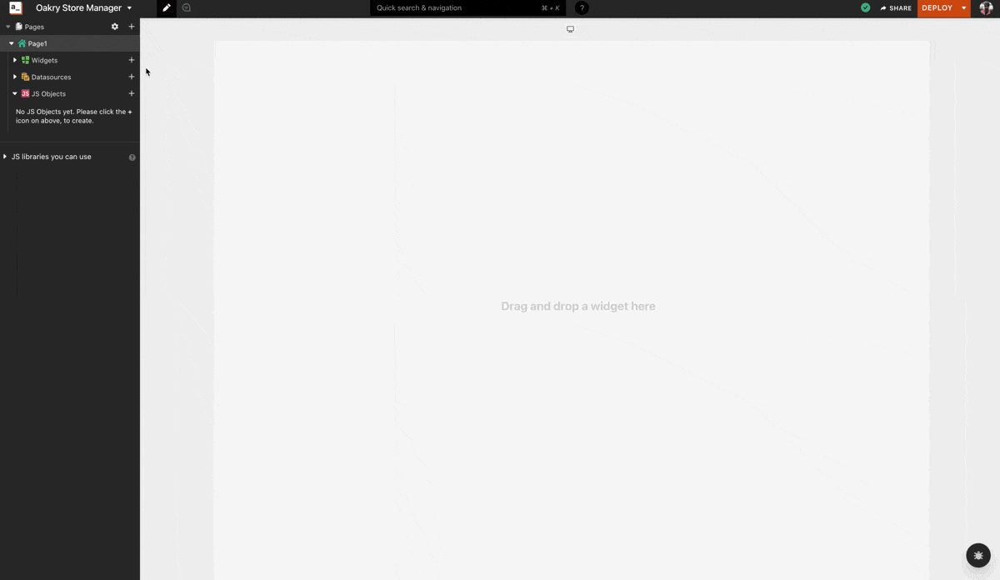
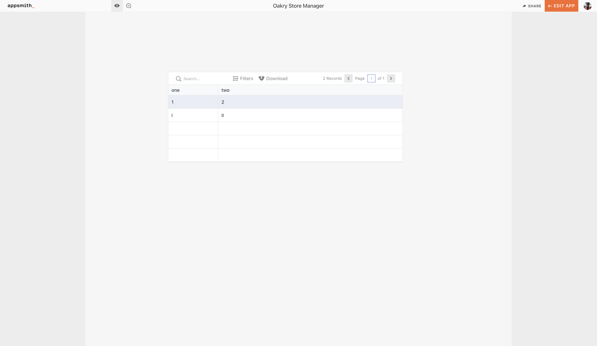
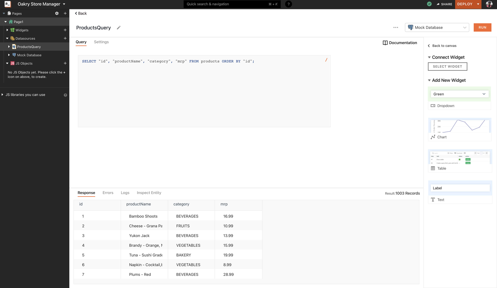

# Building a Simple UI

In this section, you will walk through creating a simple web-page that displays products fetched from a database in a table for the **Oakry** store.

By the end of part 1, you'll be familiar with:

* Creating Widgets on Appsmith
* Connect Database and writing SQL query on Appsmith
* Configuring widgets to render the results of the query

## Adding your First Widget

As discussed in the previous sections, Widgets are simple UI Components that can be added to our Apps. Now, let's add a table widget under the **`ProductListPage`** by following the below steps:

1. Navigate to **Widgets Directory** under `ProductListPage`
2. Click on `+`
3. Find the `Table` widget
4. Drag and drop it to the canvas on the right

This will create a new table on `ProductListPage`.



Let's discuss what has happened now:

* As soon as you add a new `Table` widget, you should see some pre-populated data.
* A floating window, titled **`Table1`**, open's up on the right of the table. This is the widget's property-pane; here, you can configure the widget's properties.
* The `Table Data` property in the pane defines what data will be displayed on the table. You can read more about the table widget's properties in the [Table widget reference](https://docs.appsmith.com/widget-reference/table).
* By default, the name of the table is set to **Table1**. It can be renamed to anything you like by simply double-clicking it. Let's now change it to **`Products_Table`**.

### Understanding the Table Widget

Let's now take a minute to check how the array in `Table Data` maps to the table's columns and their values.

Here are steps to play with **Table Data** to get a hang of how it affects the data displayed in the table:

1. First, go to **Table Data** property of **`Products_Table`**.
2. Copy-paste the below JSON data. 
3. The above step will update the existing pre-populated data. You'll see the updated table.
4. You can always change the values, to test it quickly, go to the first object of the array and update the value of the key `one` from `1` to `i`.
5. Verify that column **one** of the first row of the table now shows `i`.
6. Click on the **Deploy** button on the top right.

```javascript
[
  { "one": "1", "two": "2" },
  { "one": "I", "two": "II" }
]
```

Open the application's URL in your web browser. You should see the values of your table like the below screenshot:



Let's go back to the `Table Data` field. When you place your cursor in the Table Data field, you see a floating window consisting of two properties:

1. `Expected Data Type`: This field specifies the data-type expected by the property field. For the table widget, the **Expected Data Type** is `Array<Object>`. Meaning the values can be set to anything that either is or evaluates to Table Object.
2. `Evaluated Value`: This field shows in real-time what the input to the field evaluates to. This comes in handy when you write JavaScript code in the field, and you want to check whether it evaluates as expected.

By now, you have successfully displayed static data in your table. In the next section, we'll display product data from the mock database for the **Oakry** app.

However, when you are building an app for a different use-case, you can connect to your own database. Check out the [docs here](../../core-concepts/connecting-to-data-sources/) to learn to configure a database of your choice.

## Writing your First Query

Now, let's utilise the mock database to display all the catalogue items for the **Oakry** app by following the below steps:

1. First, let's create a new **Datasource** by clicking on the **"+"** icon next to **Datasource** directory.
2. Select `Create New` and choose Postgres as Database. Now use the following details and hit **Save** button.

```text
Host: fake-api.cvuydmurdlas.us-east-1.rds.amazonaws.com
Port: 5432
User: fakeapi
Password: LimitedAccess123#
Database: fakeapi
```

* Next, click on the _**New Query**_ button, you’ll see a query created with the name **Query1**
* Rename the query to **ProductsQuery**, by double-clicking on the existing one.
* Next, click on create option and replace the query shown below in the **Query** tab
* Click on the **Run** button, this will execute your query and prints out all the results below

```sql
SELECT "id", "productName", "category", "mrp" FROM products ORDER BY "id";
```

The query is saved as soon as it's created, without you having to explicitly save it. The same would be the case with any API, widgets, and any changes you make you any entity of your app.

Below is a screenshot of how Appsmith renders the outputs of SQL Query.



## Accessing Query Results to a Widget

The next step is to display the query results in the `Products_Table`, follow the below steps to do the same:

1. Navigate back to _Widgets_ under `ProductListPage` and select the `Products_Table`
2. Open `Product_Table` properties, and copy the following property to `Table Data`

```javascript
{{ProductsQuery.data}}
```

Here, we are accessing the entire query object by using the query name: `ProductsQuery`, the `.data` property allows us to attach data.

> Using the flower brackets `{{ }}` you’re asking Appsmith to resolve what is within it as JavaScript code. You can write JavaScript anywhere in Appsmith using `{{ }}`.

Setting **Table Data** to `{{ ProductsQuery.data }}` also ensures that whenever **ProductListPage** loads, **ProductsQuery** runs automatically. You can, although, change this default behavior by toggling the field "**Run query on page load**" on the **Setting** tab of **ProductsQuery**.

Now, you should see your table displays the `ProductsQuery` results. You can also deploy this and share it to display the product catalog for the Oakry app.

Below is the screenshot:


## Variables and Names

In the previous sections, we've used names to access widgets and queries. For example, you accessed a query's result by accessing a property on the query's name. In that sense, think of widgets, APIs and DB Queries in Appsmith as variables having a name. Similar to variables in other programming languages:

1. They represent an object, be it a widget, an API object, or a query object
2. They support a set of methods
3. They have a scope; they can be accessed from only within their parent page
4. All names within a page must be unique - be it widget names, query names, or API names.

As you'll see in the next section, the inverse of this is also possible, i.e a widget's state can also be accessed by a query. Furthermore, all the building blocks of an Appsmith page - Widgets, DB Queries, and APIs can access each other's data and/or state using their names.

## What's next?

When you’re comfortable with the basics of using the table-widget, setting up a DB query, and connecting the widget to display query results, read part 2 of the tutorial to learn to use widgets that enable you to accept and process user input.


