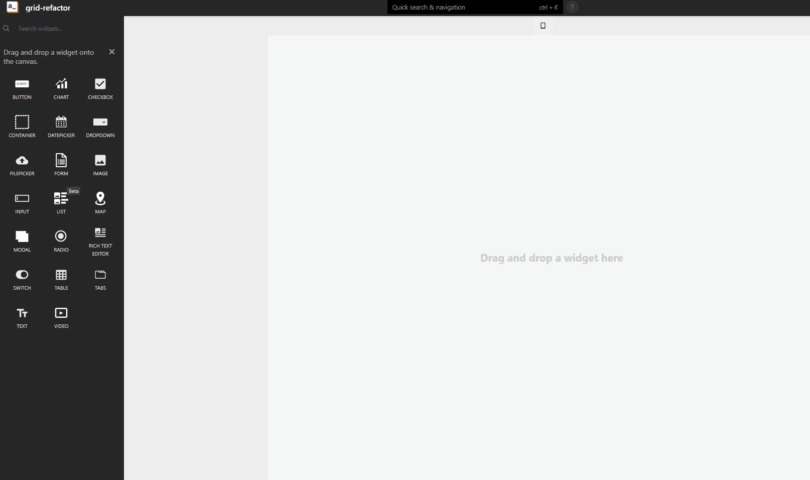

# List


List widget is in beta right now. It can only render widgets for display purposes in the template as of now. This is a platform limitation that will be solved in future. You won't be able to use any widget that has any default value \( Input, Switch, Checkbox, Select etc \)   




## Current Item

List widget is used to repeat a template based on the large data \(collection on objects\). The template is basically a container widget that repeats itself. In each widget in the template, you might need access to the current item, That's where `currentItem` property comes in handy. It gives access to the current item in the loop. For e.g - If you want to show an image widget in the list, you can use:

```text
{{ currentItem.avatar}}

// assuming avatar is a property in the array of objects in the items
```


Note: \`currentItem\` is only available in the autocomplete of controls, in the property pane of list widget template's children.   


| Widget Property | Description |
| :--- | :--- |
| **Items** | This property lets you edit the items in the list. You can either write an array of objects to display as list items or you can bind data from an API using the mustache syntax |
| **Background** | sets the background color of the list widget |
| **Item Background** | sets the background color of list items |
| **Grid Gap** | sets the margin between list items in pixels |

| Actions | Description |
| :--- | :--- |
| **onListItemClick** | Sets the action to be run when the user clicks on a list item. See a list of [supported actions](../core-concepts/writing-code/appsmith-framework.md) |

